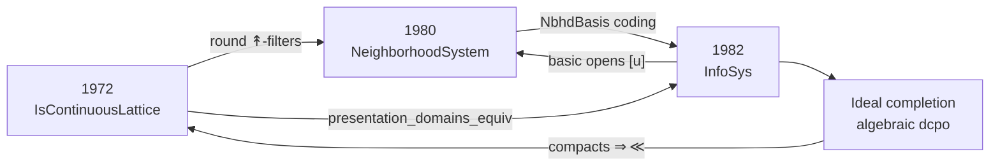
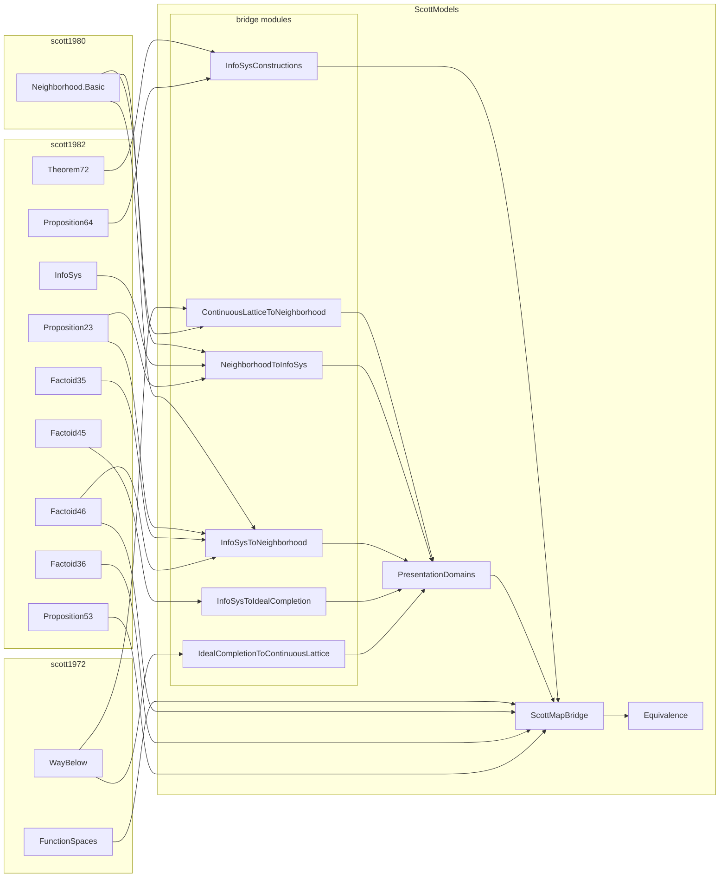

# Equivalence of Scott's Three Presentations of Domain Theory

---

## Abstract

Dana Scott developed three presentations of the same class of domains: **continuous
lattices** (1972), **neighbourhood systems** (PRG-19 / 1980–81), and **information
systems** (1982). Each sibling formalization — [`scott1972`](https://github.com/catskillsresearch/scott1972),
[`scott1980`](https://github.com/catskillsresearch/scott1980),
[`scott1982`](https://github.com/catskillsresearch/scott1982) — treats one presentation
in isolation. This package (`ScottModels`) supplies the **bridge theorems**: order
isomorphisms and constructivity audits showing that the three presentations determine
the same domains (up to isomorphism), including products, separated sums, and function
spaces at the information-system level, with a transport of 1972 Scott maps along the
round presentation.

The Lean development is sorry-free. The **1980 ↔ 1982** bridges and the round continuous
lattice corner target `#print axioms ⊆ {propext, Quot.sound}`. Classical choice appears
where Scott's 1972 topology is unavoidable (algebraic ⇒ continuous; ScottMap conjugation)
and in the trichotomy for separated sums.

---

## 1. Introduction

Scott notes in the 1982 ICALP paper that neighbourhood systems and information systems
are equivalent “in a precise sense.” The mathematical folklore is stronger still: all
three presentations carve out the same class of domains, related by ideal completion
and the Scott topology. Until the bridges are checked in a proof assistant, that claim
lives in the gap between three separately formalized libraries.

This article closes that gap. We do **not** re-prove Scott's internal theorems; we import
the finished sibling packages and build cross-presentation maps:

| Presentation | Lean package | Characteristic object |
| --- | --- | --- |
| Continuous lattices **[Sco72]** | `scott1972` | `IsContinuousLattice D`, way-below `≪`, `ScottMap` |
| Neighbourhood systems **[Sco81]** | `scott1980` | `NeighborhoodSystem`, filters as domain elements |
| Information systems **[Sco82]** | `scott1982` | `InfoSys`, elements as consistent closed token sets |

The main subtlety is that a naïve reading of “domains = filters of neighbourhoods”
overstates the continuous-lattice corner: for a continuous lattice `D`, the filter
`{↟a | a ≤ x}` has retract `x` but properly contains the principal round filter
`{↟a | a ≪ x}`. The correct identification is **`D ≃o RoundFilter`**, not raw `|𝒟|`.



We prove **order isomorphisms of domains** (and of the named construction objects), not
a 2-categorical equivalence of the full categories of continuous lattices /
neighbourhood systems / information systems with all morphisms. Morphisms are linked
where the sibling packages already supply them:

- approximable maps ↔ Scott-continuous maps on `|A|` (Factoid 4.6);
- Scott maps of continuous lattices ↔ their conjugates on the round presentation.

A full functorial equivalence (preserving products, exponentials, and inverse limits
simultaneously across all three presentations) would require additional coherence
theorems.

---

## 2. Catalog of bridge theorems

| Theorem | Direction | Lean module |
| --- | --- | --- |
| `continuousLattice_to_neighborhoodSystem` | 1972 → 1980 | `ContinuousLatticeToNeighborhood.lean` |
| `neighborhoodSystem_to_infoSys` | 1980 → 1982 | `NeighborhoodToInfoSys.lean` |
| `infoSys_to_neighborhoodSystem` | 1982 → 1980 | `InfoSysToNeighborhood.lean` |
| `infoSys_to_idealCompletion` | 1982 → algebraic | `InfoSysToIdealCompletion.lean` |
| `idealCompletion_to_continuousLattice` | algebraic → 1972 | `IdealCompletionToContinuousLattice.lean` |
| `presentation_domains_equiv` | three-way | `PresentationDomains.lean` |
| `infoSys_constructions_equiv` | constructions | `InfoSysConstructions.lean`, `ScottMapBridge.lean` |

The sibling packages are **finished dependencies**, not work items of this paper:
[`scott1972`](https://github.com/catskillsresearch/scott1972),
[`scott1980`](https://github.com/catskillsresearch/scott1980), and
[`scott1982`](https://github.com/catskillsresearch/scott1982) (information systems through
Factoid 8.4 / domain equations). This package does **not** vendor their Lean sources;
Lake path dependencies pull them in. Figure~2 is left-to-right: sibling packages on the
left, local `ScottModels/` modules on the right, with arrows for **direct** imports
(transitive imports inside the siblings are omitted). `Equivalence` re-exports the
bridges; only the `ScottMapBridge → Equivalence` edge is drawn to avoid clutter.
Root `ScottModels.lean` also opens 1972 `ContinuousLattice.Specialization`, 1980
`Neighborhood.Basic`, and 1982 `InfoSys`.

<!-- mermaid-caption: Lean module map -->


---

## 3. Proof notes

### 3.1 Continuous lattices → neighbourhood systems

**Claim.** For a continuous lattice `D`, the sets `↟a = {z | a ≪ z}` form a
`NeighborhoodSystem` on token type `D`, and under `IsContinuousLattice` one has an order
isomorphism `D ≃o RoundFilter`.

**Construction.** `wayBelowUp a` is upward closed; `↟⊥ = univ`;
`↟a ∩ ↟b = ↟(a ⊔ b)` (interpolation / directedness of way-below). Principal filters
`toFilter x = {↟a | a ≪ x}` are round: membership of `↟a` yields, by interpolation in a
continuous lattice, some `b` with `a ≪ b ≪ x`, hence `↟b ∈ toFilter x`.

**Why raw `|𝒟|` fails.** The larger filter `{↟a | a ≤ x}` still has `ofFilter = x`
(supremum of codes), but is not equal to `toFilter x` whenever there are elements
way-below strictly below `x`. Roundness (`↟a ∈ f ⇒ ∃ b, a ≪ b ∧ ↟b ∈ f`) cuts exactly
to the image of `toFilter`.

**Axioms.** `domainOrderIso : D ≃o RoundFilter` audits to `{propext, Quot.sound}`.

### 3.2 Neighbourhood systems → information systems

**Claim.** A neighbourhood system equipped with a decidable exhaustive coding
`NbhdBasis ι α` of its neighbourhood family `𝒟` induces an `InfoSys` on tokens `ι`
with `|𝒟| ≃o` the InfoSys domain.

**Construction.** Tokens are neighbourhood indices. Consistency of a finite `u ⊆ ι` is
membership of `⋂_{i∈u} nbhd i` in `𝒟` (empty intersection = master set `Δ`). Entailment
`u ⊢ j` means the intersection is a neighbourhood contained in `nbhd j`. Filters of the
neighbourhood system correspond to InfoSys elements via the coding.

**Constructivity.** `DecidableEq ι` is required so `InfoSys` can use the choice-free
`Finset` prelude from `scott1982`. The proof of `ent_con` avoids classical `by_cases` /
`em`. Axioms ⊆ `{propext, Quot.sound}`.

### 3.3 Information systems → neighbourhood systems

**Claim.** For an information system `A`, the basic opens `[u] = {x ∈ |A| | ↑u ⊆ x}`
(`u ∈ Con`) form a `NeighborhoodSystem` on `|A|`, and filters recover elements:
`|A| ≃o` the filter domain.

**Proof note.** Scott’s Factoid 4.6 supplies the basic-open vocabulary. The Lean proof
initially pulled `Classical.choice` through `simp` on `basicOpen_empty` / finset unions;
those simps were removed so the footprint stays `{propext, Quot.sound}`. Together with
§3.2 this is the constructive **1980 ↔ 1982** equivalence under coding.

### 3.4 Information systems → ideal completion

**Claim.** `|A| ≃o Ideal (FiniteElement A)`, where finite elements are closures `ū` of
consistent finsets (`Factoid 3.5`).

**Construction.** `toIdeal x` is the ideal of finite approximants of `x`; `ofIdeal`
takes directed suprema of finite elements (1982 Factoids 4.4–4.5:
`directedSup`, `eq_directedSup_finiteApproximants`, `compact_closure`). Axioms ⊆
`{propext, Quot.sound}`.

### 3.5 Algebraic complete lattices → continuous lattices

**Claim.** If every element of a complete lattice is the directed supremum of compact
elements below it (`IsAlgebraicLattice`), then `IsContinuousLattice` holds.

**Proof note.** Order-theoretic compactness implies `Set.Ici k` is Scott-open, hence
`k ≪ y` whenever `k ≤ y`. Algebraicity then yields `y = ⊔{k compact | k ≤ y} ⊆ ⊔{x | x ≪ y}`.
This is the **classical frontier**: Scott’s `≪` is defined topologically in `scott1972`,
so the footprint inherits that classicality even though the order argument is elementary.

### 3.6 Three-presentation equivalence (`presentation_domains_equiv`)

**Claim.** Under `IsContinuousLattice D` and `DecidableEq D`,
```
D ≃o RoundFilter ≃o RoundInfoSysElement
```
where `RoundInfoSysElement` is the subtype of elements of the InfoSys coded by
`wayBelowNbhdBasis` (tokens = elements of `D`, neighbourhoods = `↟a`) that correspond
to round filters. An extended form routes through the ideal-completion subtype.

**Glue.** `wayBelowNbhdBasis` packages the `↟`-system as an `NbhdBasis`;
`roundFilter_infoSys_iso` transports roundness along `NbhdBasis.domainOrderIso`;
`presentation_domains_equiv` is the composite with `continuousLattice_roundFilter_iso`.

**What is not claimed.** Raw `|𝒟|` and the full InfoSys domain `|A|` remain properly
larger than `D`. The equivalence is on the **round** corner that matches continuous
lattice points.

**Axioms.** ⊆ `{propext, Quot.sound}`.

### 3.7 Constructions (`infoSys_constructions_equiv`)

#### Products

`|A| × |B| ≃o |A × B|` via 1982 `pairElements` / `fstMap` / `sndMap` (Prop 6.2).
Choice-free; axioms ⊆ `{propext, Quot.sound}`.

#### Separated sums

`WithBot (|A| ⊕ |B|) ≃o |A + B|` via `inl` / `inr` classify-and-assemble (Prop 6.4).
Trichotomy on token polarity uses classical case-split (`Classical.choice` in the
footprint).

#### Function spaces

`ApproximableMap A B ≃o |A → B|` packages Theorem 7.2
(`approxMap_toElement` / `element_toApproxMap`) with pointwise `Le` as `PartialOrder`.
Axioms ⊆ `{propext, Quot.sound}`.

#### Factoid 4.6 bridge

`ApproximableMap A B ≃o ScottContinuous A B` via `toScottContinuous` /
`ofScottContinuous`, using Prop 5.3(v) (`rel_iff_closure_le`) and
`closure_le_element` for the round-trip on relations. Constructive:
`{propext, Quot.sound}`.

#### ScottMap conjugation

A 1972 `ScottMap D E` conjugates along any pair of order isomorphisms
`ιD : D ≃o D'`, `ιE : E ≃o E'` to a pointwise-ordered map `D' → E'`. Specializing to
`continuousLattice_roundFilter_iso` / `presentation_domains_equiv` yields
`scottMap_roundFilter_iso` and `scottMap_roundInfoSys_iso`. The conjugation itself is
order-theoretic; the footprint includes `Classical.choice` because `ScottMap` is defined
via Scott continuity in `scott1972`.

**Out of scope (documented).** Identifying `ApproximableMap` on the coded `↟`-InfoSys
with `ScottMap D E` (needs roundness preservation of approximable maps), and relating
`wayBelow(D × E)` to the InfoSys product of factors (cylinder basis).

---

## 4. Constructivity summary

| Bridge | Footprint | Notes |
| --- | --- | --- |
| Nbhd ↔ InfoSys (both directions) | `{propext, Quot.sound}` | Decidable coding; avoid classical `simp` traps |
| CL ↔ RoundFilter | `{propext, Quot.sound}` | Roundness is order-theoretic |
| InfoSys ↔ Ideal | `{propext, Quot.sound}` | Factoids 4.4–4.5 |
| Algebraic ⇒ CL | classical | 1972 topological `≪` |
| Product / function space (1982) | `{propext, Quot.sound}` | |
| Separated sum (1982) | + `Classical.choice` | Token polarity trichotomy |
| Factoid 4.6 ApproxMap ↔ ScottContinuous | `{propext, Quot.sound}` | |
| ScottMap conjugation | + `Classical.choice` | Via 1972 `ScottMap` |

Target discipline (from the 1982 package): prefer constructive proofs wherever Scott’s
1982 text emphasizes constructivity; call out classical frontiers explicitly rather than
hiding choice in automation.

---

## 5. Worked example — S-expressions / trees

Lean packaging:
[`WorkedExampleSExpr.lean`](https://github.com/catskillsresearch/scott_models/blob/main/ScottModels/WorkedExampleSExpr.lean).

### 5.1 Overview

The bridges of §§2–3 are abstract. This section fixes **one** concrete domain — Scott’s
S-expression / tree equation `T ≅ A + (T × T)` (**[Sco82]**, Factoid 8.1) over the ℕ
lower-bound atom system (Factoid 2.4) — and asks what that domain looks like in each
paradigm:

| Paradigm | What an element of `T` is |
| --- | --- |
| **1982** | a consistent, deductively closed set of tree tokens |
| **1980** | a filter of basic opens `[u]` on that token domain |
| **1972** | a point of an algebraic continuous lattice (ideal of finite elements) |

We build the domain natively as an information system (§5.2), then **read the same
carrier** as a neighbourhood system (§5.3) and as a continuous lattice (§5.4). Section 5.5
exhibits the order isomorphisms for this instance — so that, on S-expressions,

`T_1982 ≃o T_1980 ≃o Ideal(K(T))`  and  `Ideal(K(T))` is a continuous lattice,

hence transitively `T_1982 ≃o T_1980` and (via the algebraic ⇒ continuous frontier)
the 1972 presentation of the same domain. Order isomorphism is an equivalence relation,
so the three presentations determine one domain up to `≃o`. Section 5.6 records two
extras that live on top of the carriers: the domain equation at the level of domains,
and identity as a morphism in both the approximable-map and Scott-continuous languages.

### 5.2 Information system (1982)

Atoms are propositions `n ≤ x` on `ℕ` (`lowerBoundSystem`). The tree system
`SexSys := treeSystem lowerBoundSystem` has inductive tokens `TreeToken ℕ`
(`bot` / `atom` / `pairL` / `pairR`). Consistency and entailment are Scott’s sum×product
clauses; Factoid 8.1 records that this is literally the information system of the
right-hand side `A + (T × T)`:

- `SexRhs = sumSystem A (productSystem T T)` (`sexRhs_eq_sum_product`);
- token unfolding `treeUnfold` sends `atom n` to the left summand (`sexUnfold_atom`).

Finite elements include singleton atom closures `sexAtom n = ū` for `u = {atom n}`.
Elements of `|T|` are the consistent closed sets of tokens — the 1982 presentation of
the S-expression domain.

### 5.3 Neighbourhood system (1980)

From `|T|` one obtains a neighbourhood system whose basic opens are
`[u] = {x ∈ |T| | ↑u ⊆ x}`. In this paradigm an element of the domain is a
**filter** of such opens (not a raw set of tokens). Nothing new is invented: it is the
image of `SexSys` under `InfoSysToNeighborhood`. The concrete iso of §5.5 below is
exactly “read each token-element as its filter of basic opens.”

### 5.4 Continuous lattice (1972)

Finite elements `K(T)` are the closures of consistent finsets. In the algebraic style
that feeds Scott’s 1972 theory, a domain element is an **ideal** of `K(T)` — the ideal
completion of the compact basis. That poset of ideals is an algebraic complete lattice,
hence a continuous lattice (`IsAlgebraicLattice ⇒ IsContinuousLattice`, §3.5). This is
the 1972 presentation of the same S-expression domain: points ordered by inclusion of
ideals, with way-below recovered from the compact basis.

We do not claim a choice-free `D ≃o RoundFilter` story built from trees alone; the
round `↟`-filter identification of §3.1 applies once one is already in the
continuous-lattice setting.

### 5.5 Equivalence for this instance

Specializing the bridges of §3 to `SexSys` yields order isomorphisms of carriers:

- `sexNeighborhoodIso : |T| ≃o` filters of `[u]`
  (`InfoSysToNeighborhood.domainOrderIso`) — **1982 ≃o 1980**;
- `sexIdealIso : |T| ≃o Ideal (FiniteElement T)`
  (`InfoSysToIdealCompletion.domainOrderIso`) — **1982 ≃o algebraic / 1972 carrier**;
- `sexNeighborhoodIdealIso` (`neighborhood_ideal_iso`) — the constructive triangle
  closing **1980 ≃o Ideal(K(T))** without going back through tokens.

Composing any two edges recovers the third: isomorphism is transitive, so on this
example the three presentations are pairwise equivalent. The only classical step on the
1972 corner is the algebraic ⇒ continuous implication already flagged in §3.5 / §4;
the neighbourhood ↔ information ↔ ideal triangle audits to `{propext, Quot.sound}`.

### 5.6 Domain equation and morphisms

Beyond identifying the carriers, the same example exercises constructions and maps.

**Domain equation.** This article’s product and separated-sum isos lift Factoid 8.1 from
tokens to domains:

`sexDomainEquationIso :
  WithBot (|A| ⊕ (|T| × |T|)) ≃o |A + (T × T)|`

(classical footprint only through the sum trichotomy). So the S-expression equation
holds not only as information systems but as ordered domains.

**Morphisms.** The identity approximable map `idMap T` (Prop 5.4) transports along
Factoid 4.6 to a Scott-continuous endomap `sexIdScottContinuous` with `toFun = id`
(`sexId_toElement`) — the same endomap, named once in each morphism language.

**Axioms.** Object-level neighbourhood / ideal isos and Factoid 4.6 for `idMap` audit to
`{propext, Quot.sound}` up to the usual classical sum iso in `sexDomainEquationIso`.

---

## References

- **[Sco72]** Dana Scott. *Continuous Lattices*. In F. W. Lawvere (ed.), *Toposes, Algebraic
  Geometry and Logic*, LNM 274, Springer, 1972.
- **[Sco81]** Dana Scott. *Lectures on a Mathematical Theory of Computation*. Technical
  Monograph PRG-19, Oxford University Computing Laboratory, 1981 (neighbourhood systems).
- **[Sco82]** Dana Scott. *Domains for Denotational Semantics*. ICALP 1982, LNCS 140,
  Springer, 1982.
- **[AJ94]** S. Abramsky and A. Jung. *Domain Theory*. In *Handbook of Logic in Computer
  Science*, Vol. 3, Oxford University Press, 1994.
- **[GHKLMS03]** G. Gierz et al. *Continuous Lattices and Domains*. Cambridge University
  Press, 2003.
- **[SR72]** Companion Lean formalization: [`scott1972`](https://github.com/catskillsresearch/scott1972).
- **[ER80]** Companion Lean formalization: [`scott1980`](https://github.com/catskillsresearch/scott1980).
- **[SR82]** Companion Lean formalization: [`scott1982`](https://github.com/catskillsresearch/scott1982).
- **[COPE24]** Committee on Publication Ethics (COPE). *Authorship and AI tools: COPE position statement*. 2024. <https://publicationethics.org/guidance/cope-position/authorship-and-ai-tools>
<!-- AI_MODEL_REFERENCES -->
<!-- /AI_MODEL_REFERENCES -->

---

## Lean Code

All Lean 4 modules in the [scott_models](https://github.com/catskillsresearch/scott_models)
repository are listed below as GitHub links (sources stay on GitHub; nothing is inlined
in the arXiv PDF). Order matches
[`ScottModels.lean`](https://github.com/catskillsresearch/scott_models/blob/main/ScottModels.lean).

### Root

* [ScottModels.lean](https://github.com/catskillsresearch/scott_models/blob/main/ScottModels.lean)

### Library (import order)

* [NeighborhoodToInfoSys.lean](https://github.com/catskillsresearch/scott_models/blob/main/ScottModels/NeighborhoodToInfoSys.lean)
* [InfoSysToNeighborhood.lean](https://github.com/catskillsresearch/scott_models/blob/main/ScottModels/InfoSysToNeighborhood.lean)
* [ContinuousLatticeToNeighborhood.lean](https://github.com/catskillsresearch/scott_models/blob/main/ScottModels/ContinuousLatticeToNeighborhood.lean)
* [InfoSysToIdealCompletion.lean](https://github.com/catskillsresearch/scott_models/blob/main/ScottModels/InfoSysToIdealCompletion.lean)
* [IdealCompletionToContinuousLattice.lean](https://github.com/catskillsresearch/scott_models/blob/main/ScottModels/IdealCompletionToContinuousLattice.lean)
* [PresentationDomains.lean](https://github.com/catskillsresearch/scott_models/blob/main/ScottModels/PresentationDomains.lean)
* [InfoSysConstructions.lean](https://github.com/catskillsresearch/scott_models/blob/main/ScottModels/InfoSysConstructions.lean)
* [ScottMapBridge.lean](https://github.com/catskillsresearch/scott_models/blob/main/ScottModels/ScottMapBridge.lean)
* [WorkedExampleSExpr.lean](https://github.com/catskillsresearch/scott_models/blob/main/ScottModels/WorkedExampleSExpr.lean)
* [Equivalence.lean](https://github.com/catskillsresearch/scott_models/blob/main/ScottModels/Equivalence.lean)
