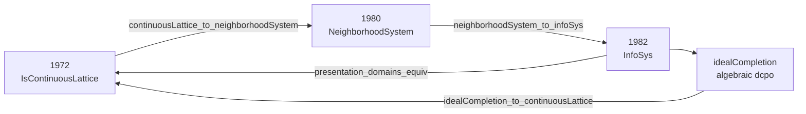

# Scott Domain Theory: Equivalence of the Three Presentations

---

## Abstract

Bridge theorems showing Scott's 1972 continuous-lattice, 1980 neighbourhood-system, and 1982 information-system presentations determine the same class of domains (up to isomorphism), with constructivity audits at the classical frontier.

Depends on [`scott1972`](https://github.com/catskillsresearch/scott1972), [`scott1980`](https://github.com/catskillsresearch/scott1980), and[`scott1982`](https://github.com/catskillsresearch/scott1982).

---

## Blueprint




Scott notes (1982) that neighborhood systems and information systems are equivalent in a precise sense; this paper makes that equivalence **checkable in Lean**. 1982 also feeds back to 1972 via ideal completion (algebraic / consistently complete presentation of the same domains).


| Theorem (planned)                         | Direction                      | Depends on                                 | Status                           |
| ----------------------------------------- | ------------------------------ | ------------------------------------------ | -------------------------------- |
| `continuousLattice_to_neighborhoodSystem` | 1972 → 1980                    | 1972 **2.11**, **2.12**; Δ as master set | **Not Yet**                      |
| `neighborhoodSystem_to_infoSys`           | 1980 → 1982                    | 1980 domain-as-filter; decidable nbhd basis | **Pass** — `NbhdBasis.toInfoSys` + `domainOrderIso` (`NeighborhoodToInfoSys.lean`); axioms ⊆ `{propext, Quot.sound}` |
| `infoSys_to_neighborhoodSystem`           | 1982 → 1980                    | 1982 Factoid 4.6 `basicOpen`             | **Pass** — `[u]`-neighbourhoods on `\|A\|` + `domainOrderIso` (`InfoSysToNeighborhood.lean`); axioms ⊆ `{propext, Quot.sound}` |
| `infoSys_to_idealCompletion`              | 1982 → algebraic dcpo          | 1982 `InfoSys.Element`                 | **Not Yet**                      |
| `idealCompletion_to_continuousLattice`    | algebraic CL → 1972            | compact elements, Scott open sets          | **Not Yet** (classical frontier) |
| `presentation_domains_equiv`              | I ↔ II ↔ III                   | all above                                  | **Not Yet**                      |
| `infoSys_constructions_equiv`             | products, sums, function space | 1972 **3.3**, 1982 constructions     | **Not Yet**                      |


| Gate                    | Requirement                                                          |
| ----------------------- | -------------------------------------------------------------------- |
| **1972 → 1980**    | Full, no Milner hypothesis needed |
| **1980 → 1982**  | 1980 domain definition + approximable maps (PRG-19 core)          |
| **1982 standalone** | **Done** in `../scott1982` (InfoSys through Factoid 8.4 / domain equations) |
| **Equivalence**      | All three presentations formalized + functorial constructions        |


### Constructivity

- **1980 ↔ 1982:** target **constructive** (Scott's 1982 text emphasizes constructive
definitions; PRG-19 notes equivalence).
- **1982 → algebraic → 1972:** document **classical frontier** (compact elements / basis of
compacts) wherever 1972 topology cannot be eliminated.


## Build

```bash
lake exe cache get
lake build ScottModels
```

Requires sibling packages `scott1972`, `scott1980`, `scott1982` (Lake path deps in `lakefile.toml`).

---

## References

- **[Sco72]**, **[Sco81]**, **[Sco82]** — the three source presentations.
- **[AJ94]** Abramsky–Jung. *Domain Theory*.
- **[GHKLMS03]** Gierz et al. *Continuous Lattices and Domains*.
