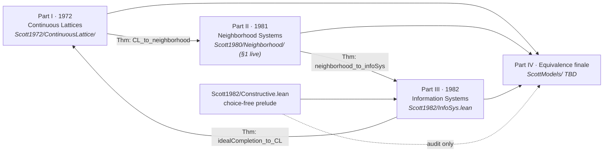

# Scott Domain Theory: Equivalence of the Three Presentations (Part IV)

---

## Abstract

**Part IV** of the Scott domain theory monograph: explicit Lean bridge theorems showing Scott's
1972 continuous-lattice, 1981 neighbourhood-system, and 1982 information-system presentations
determine the same class of domains (up to isomorphism), with constructivity audits at the
classical frontier.

Depends on [`scott1972`](https://github.com/catskillsresearch/scott1972),
[`scott1980`](https://github.com/catskillsresearch/scott1980), and
[`scott1982`](https://github.com/catskillsresearch/scott1982).

**Inventory source of truth:** this file (`arxiv.md`).

---

## 2. Four-part blueprint (one monograph)

### 2.1 Historical order and module map




The four parts are **not** independent silos within this monograph. Reading order is
**I → II → III**, then **Part IV** closes the arc. Part III also feeds back to Part I via
ideal completion (algebraic / consistently complete presentation of the same domains).

### 2.2 Planned equivalence theorems (Part IV finale)

These are the **bridge theorems for Part IV** (Lean names provisional):


| Theorem (planned)                         | Direction                      | Depends on                                 | Status                           |
| ----------------------------------------- | ------------------------------ | ------------------------------------------ | -------------------------------- |
| `continuousLattice_to_neighborhoodSystem` | 1972 → 1981                    | Part I **2.11**, **2.12**; Δ as master set | **Not Yet**                      |
| `neighborhoodSystem_to_infoSys`           | 1981 → 1982                    | Part II domain-as-filter; finite basis     | **Not Yet**                      |
| `infoSys_to_idealCompletion`              | 1982 → algebraic dcpo          | Part III `InfoSys.Element`                 | **Not Yet**                      |
| `idealCompletion_to_continuousLattice`    | algebraic CL → 1972            | compact elements, Scott open sets          | **Not Yet** (classical frontier) |
| `presentation_domains_equiv`              | I ↔ II ↔ III                   | all above                                  | **Not Yet**                      |
| `infoSys_constructions_equiv`             | products, sums, function space | Part I **3.3**, Part III constructions     | **Not Yet**                      |


Scott himself notes (1982) that neighborhood systems and information systems are equivalent
in a precise sense; **Part IV** of this monograph makes that equivalence **checkable in Lean**.

### 2.3 Gates between parts


| Gate                    | Requirement                                                          |
| ----------------------- | -------------------------------------------------------------------- |
| **Part I → Part II**    | **Pass** on **2.8–2.11** and **3.3** (full, no Milner hypothesis needed) |
| **Part II → Part III**  | Part II domain definition + approximable maps (PRG-19 core)          |
| **Part III standalone** | Prop 2.3 (1982), Scott domain = consistently complete algebraic dcpo |
| **Part IV finale**      | All three presentations formalized + functorial constructions        |


---
## 1. Part IV — Equivalence (finale, stub)

**Role:** The **closing section of this monograph**, not a separate publication. After Parts
I–III formalize Scott's three presentations, Part IV states and proves the bridge theorems
that they determine the same domains (and, where possible, the same constructions).

### 1.1 Planned theorems (see §2.2)


### 1.2 Constructivity note

- **1981 ↔ 1982:** target **constructive** (Scott's 1982 text emphasizes constructive
definitions; PRG-19 notes equivalence).
- **1982 → algebraic → 1972:** document **classical frontier** (compact elements / basis of
compacts) wherever Part I topology cannot be eliminated.

### 1.3 Status


| Block                 | Status      |
| --------------------- | ----------- |
| `ScottModels/` | **Not Yet** |
| Any bridge theorem    | **Not Yet** |


## 7. Related work

- mathlib: `Topology.Order.ScottTopology`, `Order.ScottContinuity`, `Order.OmegaCompletePartialOrder`.
- Winskel, *Formal Semantics* Ch. 8 (1982 presentation).
- Abramsky–Jung, *Domain Theory* handbook chapter.
- Gierz et al., *Continuous Lattices and Domains*.


---

## Build

```bash
lake exe cache get
lake build ScottModels
```

Requires sibling packages `scott1972`, `scott1980`, `scott1982` (Lake path deps in `lakefile.toml`).

---

## Related work

- mathlib: `Topology.Order.ScottTopology`, `Order.ScottContinuity`, `Order.OmegaCompletePartialOrder`.
- Abramsky–Jung, *Domain Theory* handbook chapter.
- Gierz et al., *Continuous Lattices and Domains*.

---

## References

- **[Sco72]**, **[Sco81]**, **[Sco82]** — the three source presentations.
- **[AJ94]** Abramsky–Jung. *Domain Theory*.
- **[GHKLMS03]** Gierz et al. *Continuous Lattices and Domains*.
